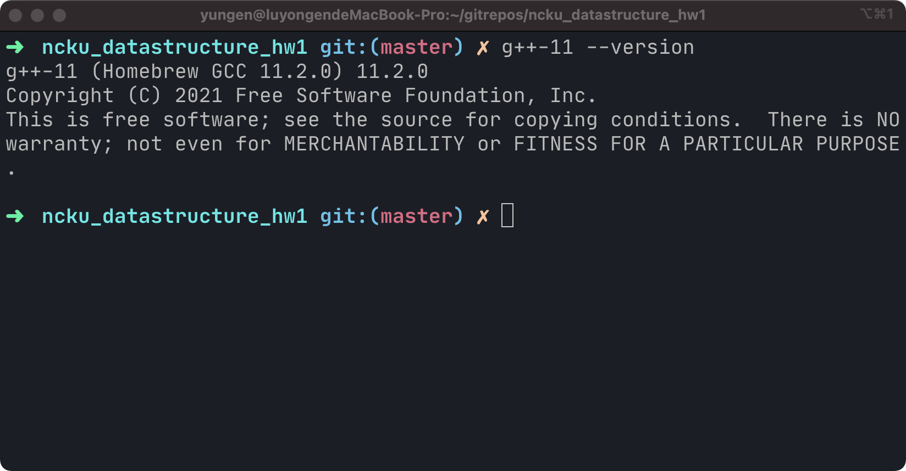

## DataStructure_HW1

#### 執行環境：

* 電腦：MacBook Pro 15-inch, 2017
* 作業系統：macOS Big Sur 11.6
* CPU: i7-7700HQ
* RAM: 16GB

#### 程式編譯環境：

* 使用程式語言：C++

在 terminal 中使用g++



編譯 argument 為 g++-11 -O2 -Wall -Wextra -std=gnu++11 -pedantic rat.cpp -o rat


若使用Dev-C++ 運行的話需要在 Tools->Compiler Options->Settings->Code generation->Language standard (-std) 中選擇 GNU C++11 或 ISO C++11 才可正確編譯

如果以上方法都不行正確編譯及執行，可以嘗試用 Docker image 執行

```shell
docker run -v "$(pwd)"/maze.txt:/app/maze.txt -it --rm yungen/ncku_datastructure_hw1
```


#### 遇到的問題

1. 一開始我用 stack of pointer to struct item 會使程式在執行 stack.pop() 時並沒有真正 delete struct item。
2. 如果 start position 或 exit position 在 barrier 上的話會有問題。
3. 如果 maze.txt 裡一行超過17個字元或超過17行的話程式會crash。
4. Line 132,29 中我初始化 std::array 使用   std::array<std::array<bool, 17>, 17> maze = {{{false}}}，在Mac 使用 g++ 編譯不會出問題，但用 Dev C++ 編譯時 line 132 會出問題。

#### 解決辦法

1. 改用 stack of struct item。
2. 使用者輸入 position 時檢查，若輸入錯誤則重新輸入。
3. 在將 maze.txt 轉成 2d array 時，增加一個檢查長度以及行數的程式碼。
4. 將 line 132 改為 std::array<std::array<bool, 17>, 17> maze = {{{}}}
